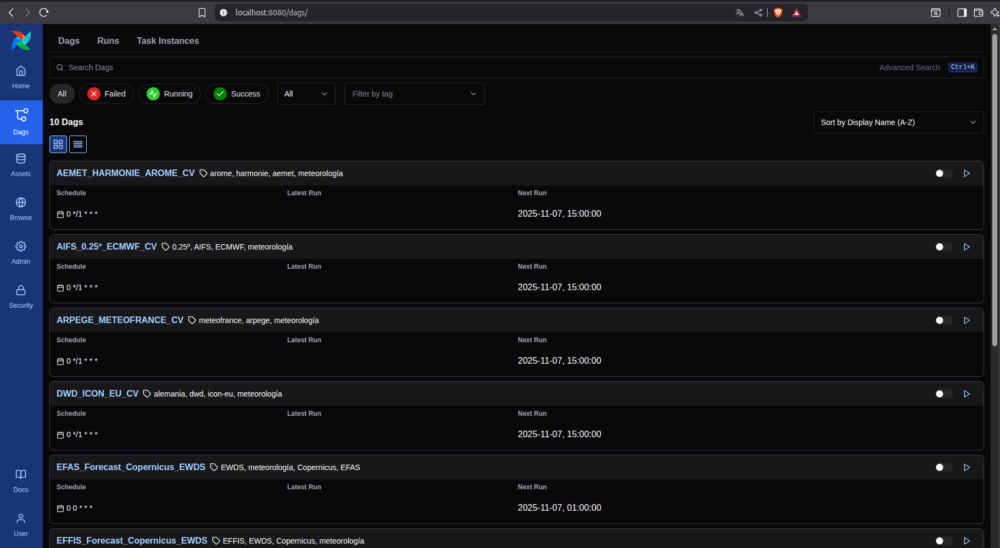
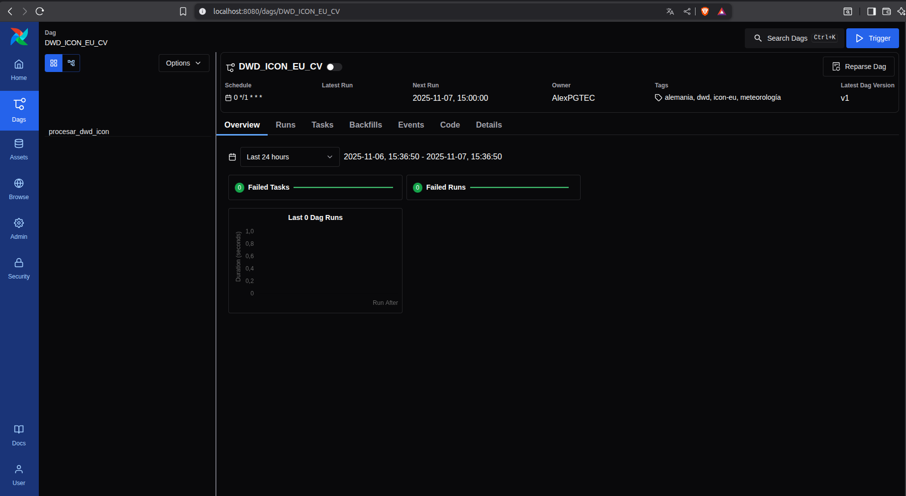
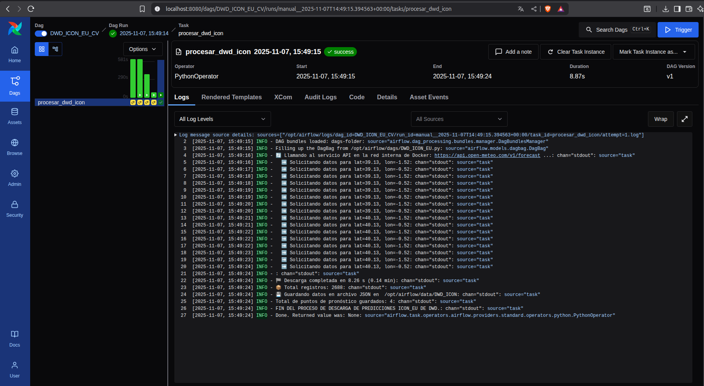

<!-- Improved compatibility of back to top link: See: https://github.com/othneildrew/Best-README-Template/pull/73 -->
<a id="readme-top"></a>
<!--
*** Thanks for checking out the Best-README-Template. If you have a suggestion
*** that would make this better, please fork the repo and create a pull request
*** or simply open an issue with the tag "enhancement".
*** Don't forget to give the project a star!
*** Thanks again! Now go create something AMAZING! :D
-->


<!-- PROJECT SHIELDS -->
<!--
*** I'm using markdown "reference style" links for readability.
*** Reference links are enclosed in brackets [ ] instead of parentheses ( ).
*** See the bottom of this document for the declaration of the reference variables
*** for contributors-url, forks-url, etc. This is an optional, concise syntax you may use.
*** https://www.markdownguide.org/basic-syntax/#reference-style-links
-->
<!--
[![Contributors][contributors-shield]][contributors-url]
[![Forks][forks-shield]][forks-url]
[![Stargazers][stars-shield]][stars-url]
[![Issues][issues-shield]][issues-url]
[![Unlicense License][license-shield]][license-url]
[![LinkedIn][linkedin-shield]][linkedin-url]
-->


<!-- PROJECT LOGO -->
<br />
<div align="center">
  <a href="https://airflow.apache.org/">
    
  </a>

  <h3 align="center">Airflow</h3>

  <p align="center">
    Repository containing Python scripts to ingest data from multiple climate models, transform it into FIWARE Smart Data Model WeatherForecastSeries, and build Airflow DAGs to orchestrate automated data pipelines.
    <br />
    <a href="https://pgtec-vrain.github.io/welcome/"><strong>See the PGTEC web page »</strong></a>
    <br />
    <!--<br />
    <a href="https://github.com/othneildrew/Best-README-Template">View Demo</a>
    &middot;
    <a href="https://github.com/othneildrew/Best-README-Template/issues/new?labels=bug&template=bug-report---.md">Report Bug</a>
    &middot;
    <a href="https://github.com/othneildrew/Best-README-Template/issues/new?labels=enhancement&template=feature-request---.md">Request Feature</a>-->
  </p>
</div>


<!-- TABLE OF CONTENTS -->
<details>
  <summary>Table of Contents</summary>
  <ol>
    <li>
      <a href="#about-the-project">About The Service</a>
      <ul>
        <li><a href="#built-with">Built With</a></li>
      </ul>
    </li>
    <li>
      <a href="#getting-started">Getting Started</a>
      <ul>
        <!--<li><a href="#prerequisites">Prerequisites</a></li>-->
        <!--<li><a href="#cheatsheet">Cheatsheet</a></li>-->
      </ul>
    </li>
    <li><a href="#usage">Usage</a></li>
    <!--<li><a href="#roadmap">Roadmap</a></li>-->
    <!--<li><a href="#contributing">Contributing</a></li>-->
    <li><a href="#license">License</a></li>
    <li><a href="#contact">Contact</a></li>
    <li><a href="#references">References</a></li>
  </ol>
</details>


<!-- ABOUT THE SERVICE -->
## About The service 

Apache Airflow is a service that enables the programmatic execution of different tasks. In this project, Airflow's objective is to periodically execute Python scripts that access multiple weather forecast model data sources to extract the most recent forecasts and store them. Using Airflow makes it possible to automatically obtain the most recent model forecasts once the frequency of model execution is known.

The prediction models of interest in the project are as follows:

- ARPEGE from MeteoFrance
- ICON_EU from the German Meteorological Service (DWD)
- GFS from the US agency (NOAA)
- IFS from the European agency (ECMWF)
- AIFS from the European agency (ECMWF)
- GEPS from the Canadian agency (CNC)
- Seas5 from Copernicus (ECMWF)
- Harmonie-Arome from AEMET
- EFAS from Copernicus 
- EFFIS from Copernicus

The predictions of all models except the last three can be accessed from the <a href="https://open-meteo.com/">Open-Meteo</a> API. The Harmonie-Arome model predictions can be accessed via the official website. The EFAS and EFFIS predictions can be accessed via the Copernicus Climate Data Store (CDS).

### Built With

The service is built using the following main components:

<div align="center">

| | | | |
|:-------------------------------------------:|:--------------------:|:-------------------:|:---------------------:|
| [![Python][Python]][Python-url] | [![Airflow][Airflow]][Airflow-url] | [![Smart-data-models][Smart-data-models]][Smart-Data-models-url] | [![Docker][Docker]][Docker-url] |


</div>

<p align="right">(<a href="#readme-top">back to top</a>)</p>

<!-- GETTING STARTED -->
### Getting Started 

Here is a brief explanation of the Python scripts:

- `AEMET_HARMONIE_AROME.py`: Python script that retrieves weather forecast data from the AEMET website and processes it programatically using airflow sintaxis

  - **Data**: All the data is processed into a standardized format defined by the `WeatherForecastSeries.py` Smart Data Model. The variables we are currently using are:
    - Temperature 
    - Precipitation
    - Wind Speed 

  - **Raw Data**: The input data are GeoTIFF (.tif) files containing weather variables encoded as color values. Using a color scale provided by AEMET, the script converts these color codes (RGBA) into real physical values such as temperature, wind speed, and precipitation.

  - **API Key**: No API key is required for execution as we are downloading public data from AEMET website.

  - **Run script**: Run hourly to ensure the latest forecasts are always retrieved and processed.
 
All the following scripts retrieve data from OpenMeteo API:

- `AIFS_ECMWF.py`: Python script that retrieves weather data from the Open-Meteo API programamatically using airflow sintaxis.

  - **Data**: processes it into a standardized format using `WeatherForecastSeries.py` Smart Data Model. 

  - **Raw Data**: The input data are JSON files. The variables we are currently using are:
    - Temperature 
    - Precipitation
    - Wind Speed

  - **API Key**: No API key is required for execution as we are downloading public data from Open-Meteo API.

  - **Run script**: Run hourly to ensure the latest forecasts are always retrieved and processed.

- `ARPEGE.py`: Python script that retrieves weather data from the Open-Meteo API programamatically using airflow sintaxis.

  - **Data**: processes it into a standardized format using `WeatherForecastSeries.py` Smart Data Model. 

  - **Raw Data**: The input data are JSON files. The variables we are currently using are:
    - Temperature 
    - Precipitation
    - Relative Humidity
    - Solar Radiation

  - **API Key**: No API key is required for execution as we are downloading public data from Open-Meteo API.

  - **Run script**: Run hourly to ensure the latest forecasts are always retrieved and processed.

- `DWD_ICON_EU.py`: Python script that retrieves weather data from the Open-Meteo API programmatically using airflow sintaxis.

  - **Data**: processes it into a standardized format using `WeatherForecastSeries.py` Smart Data Model. 

  - **Raw Data**: The input data are JSON files. The variables we are currently using are:
    - Temperature 
    - Precipitation

  - **API Key**: No API key is required for execution as we are downloading public data from Open-Meteo API.

  - **Run script**: Run hourly to ensure the latest forecasts are always retrieved and processed.

- `GEPS_ENS_CNC.py`: Python script that retrieves weather data from the Open-Meteo API programamatically using airflow sintaxis.

  - **Data**: processes it into a standardized format using `WeatherForecastSeries.py` Smart Data Model. 

  - **Raw Data**: The input data are JSON files. The variables we are currently using are:
    - Temperature 
    - Precipitation
    - Wind Speed

  - **API Key**: No API key is required for execution as we are downloading public data from Open-Meteo API.

  - **Run script**: Run hourly to ensure the latest forecasts are always retrieved and processed.

- `GFS_NOAA.py`: Python script that retrieves weather data from the Open-Meteo API programamatically using airflow sintaxis.

  - **Data**: processes it into a standardized format using `WeatherForecastSeries.py` Smart Data Model. 

  - **Raw Data**: The input data are JSON files. The variables we are currently using are:
    - Temperature 
    - Precipitation
    - Wind Speed
    - Solar Radiation

  - **API Key**: No API key is required for execution as we are downloading public data from Open-Meteo API.

  - **Run script**: Run hourly to ensure the latest forecasts are always retrieved and processed.


- `IFS9km_ECMWF.py`: Python script that retrieves weather data from the Open-Meteo API programamatically using airflow sintaxis.

  - **Data**: processes it into a standardized format using `WeatherForecastSeries.py` Smart Data Model. 

  - **Raw Data**: The input data are JSON files. The variables we are currently using are:
    - Temperature 
    - Precipitation
    - Wind Speed

  - **API Key**: No API key is required for execution as we are downloading public data from Open-Meteo API.

  - **Run script**: Run hourly to ensure the latest forecasts are always retrieved and processed.

- `Seas5_ECWMF_copernicus.py`: Python script that retrieves weather data from the Open-Meteo API programamatically using airflow sintaxis.

  - **Data**: processes it into a standardized format using `WeatherForecastSeries.py` Smart Data Model. 

  - **Raw Data**: The input data are JSON files. The variables we are currently using are:
    - Temperature 
    - Precipitation
    - Wind Speed
    - Solar Radiation

  - **API Key**: No API key is required for execution as we are downloading public data from Open-Meteo API.

  - **Run script**: Run hourly to ensure the latest forecasts are always retrieved and processed.

The last two scrips retrieve data from Copernicus Climate Data Store (CDS) API and Early Warning Data Store (EWDS):

- `EFFIS.py`: Python script that retrieves weather data from the dataset (https://cds.climate.copernicus.eu/datasets/sis-tourism-fire-danger-indicators?tab=overview) and download data programamatically using airflow sintaxis. 

  - **Data**: processes it into a standardized format using `WeatherForecastSeries.py` Smart Data Model. 

  - **Raw Data**: The input data are NetCDF (.nc) files containing various weather variables:
    - Daily fire weather index

  - **API Key**: An API key is required for execution. To get an API key, you need to register on the Copernicus Climate Data Store website: https://cds.climate.copernicus.eu

  - **Run script**: Run this script daily because Copernicus updates the data once a day. It has been configured to automatically detect the latest available forecast.

- `EFAS.py`: Python script that retrieves weather data from the EWDS dataset (https://ewds.climate.copernicus.eu/datasets/efas-forecast?tab=overview) and download data programamatically using airflow sintaxis.

  - **Data**: processes it into a standardized format using `WeatherForecastSeries.py` Smart Data Model. 

  - **Raw Data**: The input data are NetCDF (.nc) files containing the following weather variable:
    - River discharge last 6 hours

  - **API Key**: An API key is required for execution. To get an API key, you need to register on the Copernicus Climate Data Store website: https://cds.climate.copernicus.eu

  - **Run script**: Run this script daily because Copernicus updates the data once a day. It has been configured to automatically detect the latest available forecast.

<!--
### Prerequisites

These are the necessary requirements to be able to execute the project:

|                    Software                              | Version / Notes |
| --------------------------------------------------------:|:------- |
| [Python](https://www.python.org/) | 3.x.x  |
| [Airflow](https://airflow.apache.org/) | 2.x  |


### Cheatsheet

* Python (Recommended to create an environment from anaconda / miniconda)
  ```bash
    # Download Miniconda installer (Linux x86_64)
    wget https://repo.anaconda.com/miniconda/Miniconda3-latest-Linux-x86_64.sh -O ~/miniconda.sh

    # Run the installer
    bash ~/miniconda.sh

    # Follow the prompts (accept license, choose install path, initialize conda)

    # Initialize conda for bash
    source ~/.bashrc

    # Create a project environment (Python 3.12.3)
    conda create -n pgtec_env python=3.12.3 -y
    conda activate pgtec_env
  ```

<p align="right">(<a href="#readme-top">back to top</a>)</p>

-->

<!-- USAGE EXAMPLES -->
## Usage

En este apartado se describe la forma de desplegar y usar el servicio Airflow mediante un ejemplo guiado.

Para desplegar el servicio:

El primer paso para desplegar el entorno es tener el repositorio de Github clonado en el ordenador. Para ello se pueden seguir las instrucciones siguientes en una terminal Ubuntu:

1. Clone the repo and navigate to the service folder
   ```sh
   git clone https://github.com/PGTEC-VRAIN/SmartFlow
   cd SmartFlow/Airflow
   ``` 

El segundo paso es levantar el serivicio Docker que previamente se debe tener instalado en el ordenador.

2. Initialize docker:
   ```sh
   sudo systemctl start docker
   ```

El tercer y último paso es inicializar los contenedores construyendolos primeramente con `--build` y luego levantandolos con `up`. Todo ello se puede realizar en la misma linea. Para evitar los logs de ejecución se usa el parámetro `-d`.

3. Initialize docker containers
   ```sh
   docker compose up --build -d
   ```

Para usar el servicio:

El primer paso es acceder a la página web local donde está Airflow en ejecución. El servicio está diseñado para correr en localhost en el puerto 8080. Por tanto, se debe acceder a la siguiente URL para entrar en Airflow:

1. Acceso a la URL de Airflow:
  ```sh
  http:localhost:8080
  ```
En la configuración del servicio Airflow se han establecido las siguientes credenciales para acceder a Airflow:

2. Credenciales para inicio de sesión:
  ```sh
  user: airflow
  password:airflow
  ```

Una vez accedido a la web, el próximo paso es acceder a una DAG. Para ello se debe buscar el modelo de interés y acceder a la DAG clickando en ella. La siguiente captura muestra las DAGS disponibles en la web Airflow:

<div align="center">



</div>

Al acceder a la DAG se muestra la siguiente ventana. Para activar la DAG se debe clickar en el botón `Trigger` situado en la esquina superior derecha tal y como muestra la siguiente imagen:

<div align="center">



</div>

Una vez la DAG se encuentra en ejecución, se accede una nueva ventana que describe en tiempo real el estado de la ejecución de la DAG. En esta ventana se recomienda acceder a la tarea que se está ejecutando clickando sobre ella. A continuación, la siguiente ventana es mucho más completa. En ella se muestra el tiempo de ejecución, el progreso de la misma, el código que se está ejecutando y los logs. Para comprobar que la DAG se ha ejecutado correctamente se pueden acceder a los logs y revisar que se han descargado los datos del modelo correctamente. A continuación, se muestra una captura de los logs del modelo DWD_ICON:

<div align="center">



</div>

En la captura se puede observar que el script se ha ejecutado sin problema y se han guardado las predicciones del modelo ICON_EU en formato JSON siguiendo el Smart Data Model WeatherForecastSeries. El siguiente paso a implementar es guardar los datos JSON en Orion-LD

EXPLICACIÓN DE  GUARDAR LOS DATOS EN ORION-LD
To fill...

<!-- ROADMAP 
## Roadmap

- [x] Add Changelog
- [x] Add back to top links
- [ ] Add Additional Templates w/ Examples
- [ ] Add "components" document to easily copy & paste sections of the readme
- [ ] Multi-language Support
    - [ ] Chinese
    - [ ] Spanish

See the [open issues](https://github.com/othneildrew/Best-README-Template/issues) for a full list of proposed features (and known issues).

<p align="right">(<a href="#readme-top">back to top</a>)</p>
-->


<!-- CONTRIBUTING 
## Contributing

Contributions are what make the open source community such an amazing place to learn, inspire, and create. Any contributions you make are **greatly appreciated**.

If you have a suggestion that would make this better, please fork the repo and create a pull request. You can also simply open an issue with the tag "enhancement".
Don't forget to give the project a star! Thanks again!

1. Fork the Project
2. Create your Feature Branch (`git checkout -b feature/AmazingFeature`)
3. Commit your Changes (`git commit -m 'Add some AmazingFeature'`)
4. Push to the Branch (`git push origin feature/AmazingFeature`)
5. Open a Pull Request
-->
<!---
### Top contributors:

<a href="https://github.com/othneildrew/Best-README-Template/graphs/contributors">
  
</a>

<p align="right">(<a href="#readme-top">back to top</a>)</p>

-->

<!-- LICENSE -->
## License

Distributed under the AGPL-3.0 License. See `LICENSE` for more information.

<p align="right">(<a href="#readme-top">back to top</a>)</p>


<!-- CONTACT -->
## Contact

Project Link: [https://github.com/PGTEC-VRAIN](https://github.com/PGTEC-VRAIN)

<p align="right">(<a href="#readme-top">back to top</a>)</p>


<!-- References -->
## References

* [Readme Template](https://github.com/othneildrew/Best-README-Template)
* Smart Data Models [Weather Smart Data Model - Fiware](https://github.com/smart-data-models/dataModel.Weather)


<p align="right">(<a href="#readme-top">back to top</a>)</p>


<!-- MARKDOWN LINKS & IMAGES -->
<!-- https://www.markdownguide.org/basic-syntax/#reference-style-links -->
[Python]: https://img.shields.io/badge/python-3.12.11+-blue.svg?logo=python&logoColor=white
[Python-url]: https://www.python.org/
[Airflow]: https://img.shields.io/badge/airflow-3.0.6-green.svg?logo=apacheairflow&logoColor=white
[Airflow-url]: https://airflow.apache.org/
[Smart-data-models]: https://img.shields.io/badge/SmartDataModels-purple.svg
[Smart-Data-models-url]: https://github.com/smart-data-models/dataModel.Weather
[Docker-url]: https://www.docker.com/
[Docker]: https://img.shields.io/badge/docker-44.4.3+-red.svg?logo=python&logoColor=white
