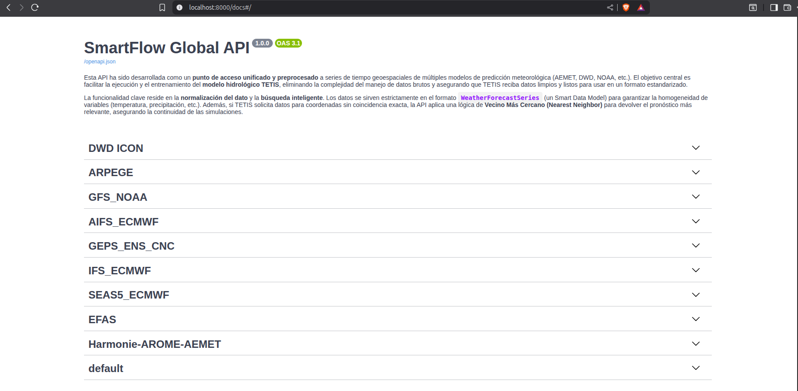
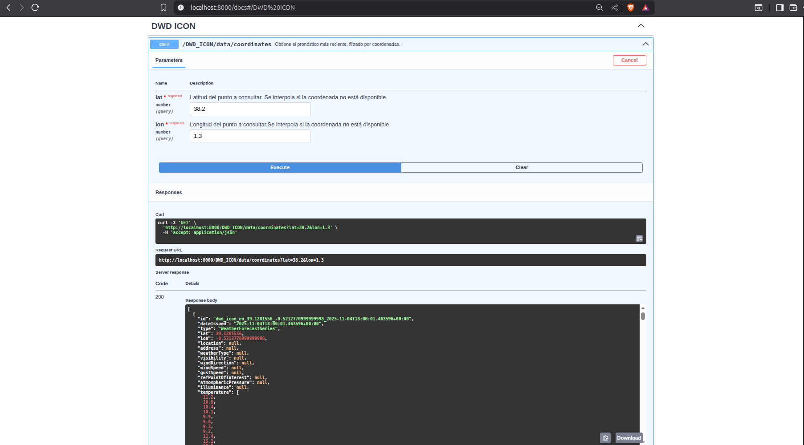

# 🌦️ SmartFlow FastAPI — Unified Access to Meteorological Forecasts

## Overview

This **FastAPI service** acts as a **unified and preprocessed access point** to geospatial time series from multiple meteorological forecast models (AEMET, DWD, ECMWF, NOAA, Copernicus...).  

Its main goal is to **provide standardized weather prediction data to the TETIS hydrological model**, ensuring that TETIS receives **clean, normalized and ready-to-use Smart Data Models** without the need to handle raw datasets or heterogeneous APIs.

The service is part of the [PGTEC Project (VRAIN–UPV)](https://pgtec-vrain.github.io/), under the SmartFlow infrastructure, and it works together with **Airflow workflows** that periodically retrieve and preprocess the forecast data.

---

## 🚀 Core Functionality

### 🔹 Data Normalization

All forecasts are served following the **FIWARE Smart Data Model** [`WeatherForecastSeries`](https://github.com/PGTEC-VRAIN/SmartFlow/tree/main/SmartDataModels/WeatherForcastSeries), guaranteeing consistency across data sources for key variables such as:

- `temperature`
- `precipitation`
- `Wind Speed`
- `Solar Radiation`
- `Relative Hummidity`
- `River Discharge`

### 🔹 Interpolation

If a requested coordinate does **not exactly match** any point in the dataset, the API applies a **Nearest Neighbor (NN) search** to return the closest forecast.  
This ensures **spatial continuity** and avoids gaps in hydrological simulations.

---

## 🧩 Available Endpoints

The API currently exposes **nine endpoints**, each corresponding to a different meteorological prediction model.  
All of them return data in the `WeatherForecastSeries` format.

| Endpoint | Source | Description | Smart Data Model |
|-----------|---------|-------------|------------------|
| `/Harmonie-AROME-AEMET` | AEMET | High-resolution short-term forecasts (HARMONIE-AROME) | WeatherForecastSeries |
| `/ARPEGE` | Open-Meteo (ARPEGE) | Global forecast model from Météo-France | WeatherForecastSeries |
| `/DWD_ICON` | Open-Meteo (DWD)| ICON model from Deutscher Wetterdienst | WeatherForecastSeries |
| `/AIFS_ECMWF` | Open-Meteo (AIFS) | Artificial Intelligence Forecast System | WeatherForecastSeries |
| `/GEPS_ENS_CNC` | Open-Meteo (GEPS) | Canadian Meteorological Center ensemble forecasts | WeatherForecastSeries |
| `/GFS_NOAA` | Open-Meteo (NOAA) | Global Forecast System from the U.S. | WeatherForecastSeries |
| `/IFS9km_ECMWF` | Open-Meteo (ECMWF) | IFS 9 km global forecasts | WeatherForecastSeries |
| `/SEAS5_ECMWF` | Open-Meteo (ECMWF)  | Seasonal climate forecast (SEAS5) | WeatherForecastSeries |
| `/EFAS` | Copernicus CDS | European Flood Awareness System (discharge forecasts) | WeatherForecastSeries |
| `/EFFIS` | Copernicus CDS | European Forest Fire Information System (fire weather indices) | WeatherForecastSeries |

> 💡 Each endpoint can be queried by **latitude**, **longitude**, and **variable**, and will automatically return the closest available forecast data.

---

## ⚙️ Example — Retrieving Forecast Data from DWD_ICON Endpoint

Below is a practical example of how the API serves standardized weather forecast data from the **DWD ICON** model through the FastAPI interface.


### Request 

Using command line:

```bash
curl -X 'GET' \
  'http://localhost:8000/DWD_ICON/data/coordinates?lat=38.4&lon=1.2' \
  -H 'accept: application/json'
```

Using web link:

```sh
http://localhost:8000/DWD_ICON/data/coordinates?lat=38.4&lon=1.2
```

An extract of the json response:

```json
[
  {
    "id": "HARMONIE_AROME_2025-11-05T11:00:06.272766",
    "dateIssued": "2025-11-05T11:00:06.272766",
    "type": "WeatherForecastSeries",
    "lat": 38.400000000000006,
    "lon": 0.4750000000000014,
    "location": null,
    "address": null,
    "weatherType": null,
    "visibility": null,
    "windDirection": null,
    "windSpeed": [
      20,
      20,
      20,
      20,
      20,
      20,
      20,
      20,
      20,
      20,
      20,
      20,
      28.02596664428711,
      ...
      ]
    }
]
```

### 📷 Visual Output

Below are screenshots showing how this request appears in the FastAPI Swagger interface and the JSON response returned by the API:

First, a screenshot that shows all the endpoints:

<div align="center">




Request and response using FastAPI Swagger UI



</div>

## 🧩 Integration with Airflow and TETIS

Airflow DAGs handle the automated data acquisition and transformation from the original sources.

FastAPI services serve the preprocessed data through REST endpoints.

TETIS Dashboard uses these APIs to retrieve and load forecasts for hydrological simulations automatically.

When a user selects a source and coordinates in TETIS:

- TETIS triggers the corresponding FastAPI endpoint.

- The endpoint retrieves the latest preprocessed Smart Data Model.

- The forecast is ingested directly into the TETIS model.

## 🐳 Deployment with Docker

Build and start containers
```sh
docker compose up --build -d
```

Access FastAPI interactive docs
```sh
👉 http://localhost:8000/docs
```

Example query
```bash
curl "http://localhost:8000/aemet_harmonie_arome?lat=39.47&lon=-0.38"
```

## Built With

The project is built using the following main components:

<div align="center">

| | | | | | |
|:-------------------------------------------:|:--------------------:|:-------------------:|:---------------------:|:----------------:|:------------------:|
| [![Python][Python]][Python-url] | [![FastAPI][FastAPI]][FastAPI-url] | [![Airflow][Airflow]][Airflow-url] | [![Smart-data-models][Smart-data-models]][Smart-Data-models-url] | [![Docker][Docker]][Docker-url] |

</div>


[Python]: https://img.shields.io/badge/python-3.12.11+-blue.svg?logo=python&logoColor=white
[Python-url]: https://www.python.org/
[Airflow]: https://img.shields.io/badge/airflow-3.0.6-green.svg?logo=apacheairflow&logoColor=white
[Airflow-url]: https://airflow.apache.org/
[Smart-data-models]: https://img.shields.io/badge/SmartDataModels-purple.svg
[Smart-Data-models-url]: https://github.com/smart-data-models/dataModel.Weather
[Docker-url]: https://www.docker.com/
[Docker]: https://img.shields.io/badge/docker-44.4.3+-red.svg?logo=python&logoColor=white
[FastAPI]: https://img.shields.io/badge/FastAPI-blue
[FastAPI-url]: https://fastapi.tiangolo.com/
